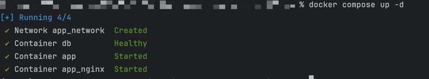
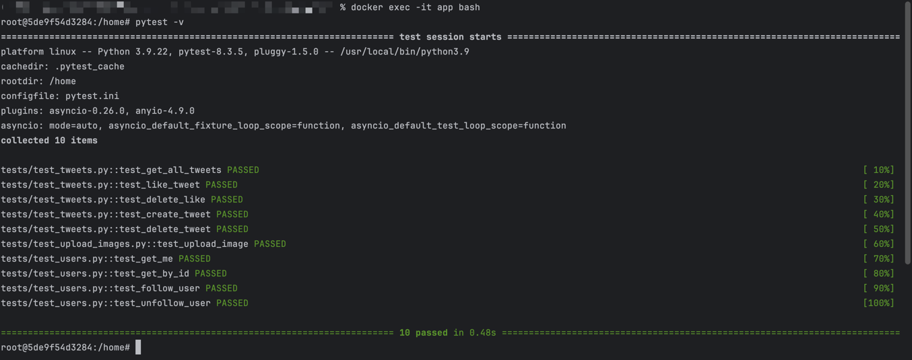

# Описание проекта "Twitter-Clone"
Проект представляет собой бэкенд-составляющую для клона Twitter, включающую API-функции и взаимодействие с базой данных (PostgreSQL). Он позволяет:
- Создавать новые твиты с текстом и изображениями (или без);
- Ставить и удалять лайки с твитов;
- Просматривать информацию о себе и других пользователях;
- Подписываться на других пользователей и отписываться от них.

Регистрация пользователей не предусмотрена — аутентификация осуществляется с помощью API-ключа, передаваемого в header.

## Технологии и библиотеки
- **Python 3.9**: основной язык программирования проекта;
- **FastAPI**: Асинхронный веб-фреймворк для разработки RESTful API;
- **PostgreSQL**: Реляционная база данных для хранения данных пользователей и твитов;
- **SQLAlchemy**: ORM для работы с базой данных;
- **Pydantic**: Для валидации и обработки данных, передаваемых в запросах и ответах;
- **Pytest**: Используется для написания и выполнения тестов;
- **Nginx**: Веб-сервер для проксирования запросов между фронтендом и FastAPI;
- **Docker и Docker Compose**: Для контейнеризации всех компонентов проекта и упрощения процесса развертывания.

## Структура проекта
- **app**: Содержит всю логику работы бэкенда;
  - **app/db**: Логика работы с базой данных (описание моделей, Pydantic-схемы, настройки БД);
  - **app/routes**: CRUD-функции для манипуляций с данными и роуты API;
- **static**: Содержит статические файлы для фронтенда;
- **tests**: Содержит тесты для проверки функциональности бэкенда (использует Pytest);
- **Dockerfile**: Конфигурация для сборки образа Docker для проекта;
- **docker-compose.yml**: Конфигурация для запуска всех сервисов проекта (бэкенд, база данных, Nginx) в Docker.

## Установка и настройка
1. Клонирование репозитория:
    ```bash
    git clone <URL репозитория>
    cd <Имя папки проекта>
    ```

2. Собираем и запускаем контейнеры с приложением (предполагается, что Docker установлен заранее):
    ```bash
   docker compose up -d      
   ```
    

3. Для тестирования нужно выполнить последовательно 2 команды (докер должен быть успешно запущен):
    ```bash
   docker exec -it <Имя контейнера с приложением, по умолчанию (app)> bash
   ```
   Узнать *Имя контейнера* можно командой
    ```bash
   docker ps
   ```
   
4. После выполнения предыдущей команды будете находится в контейнере с приложением:
    ```bash
    pytest -v 
    ```
   

5. Остановить докер можно с помощью команды:
    ```bash
   docker compose stop
   ```
   
### Документация
После запуска докера можно ознакомиться с документацией по адресу:
```url
http://<домен(по умолчанию localhost)>:8000/docs
```